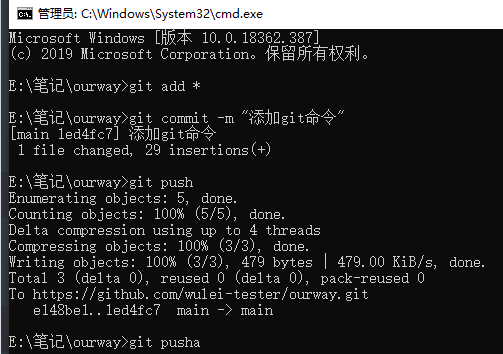

# 常用命令

## 项目安装


## windows


## GIT

1.  添加要提交的文件

   ```shell
   git add 文件名
   ```

   

2. 提交文件

   ```shell
   git commit -m "提交的注释"
   ```

   

3. 推送到GitHub上面

   ```shell
   git push 
   ```




